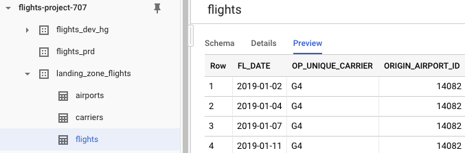
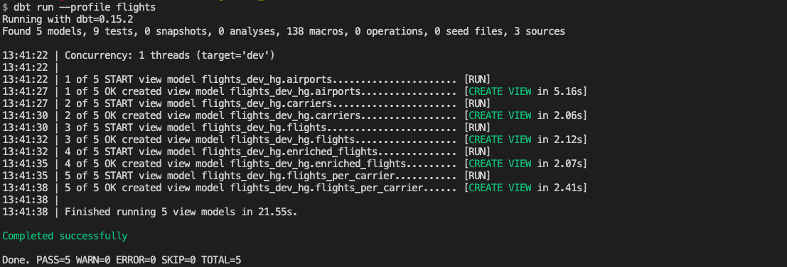
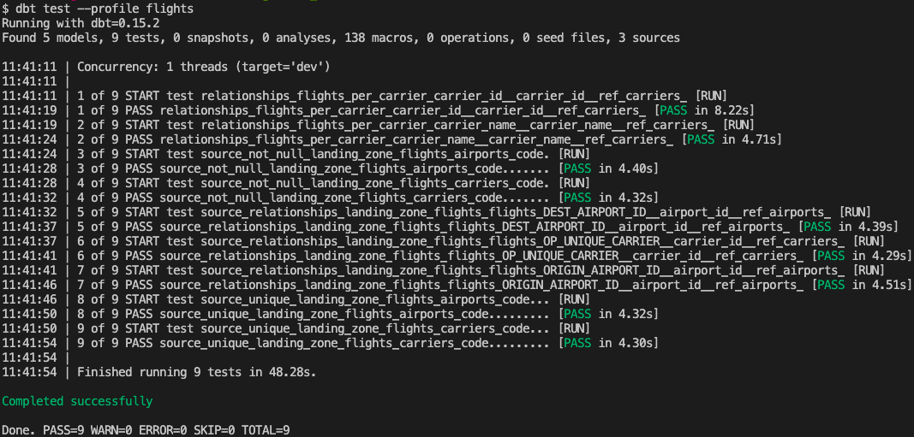
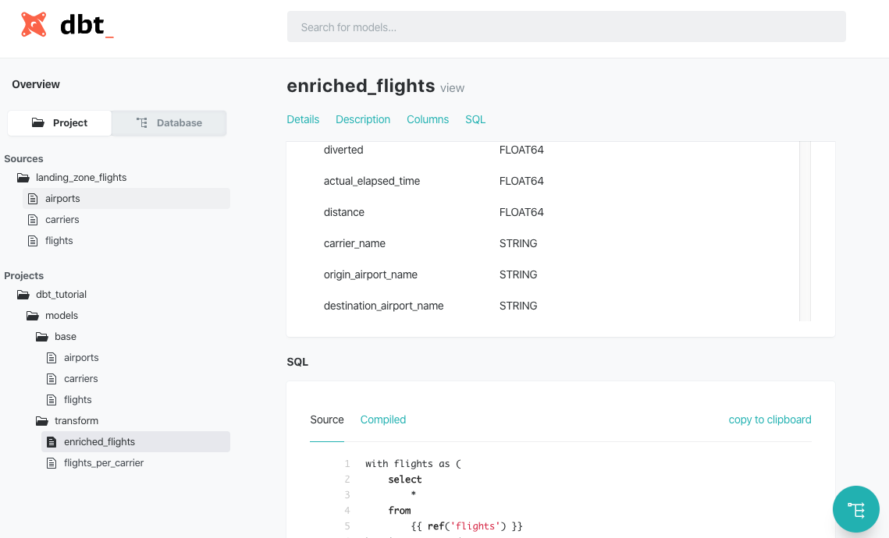
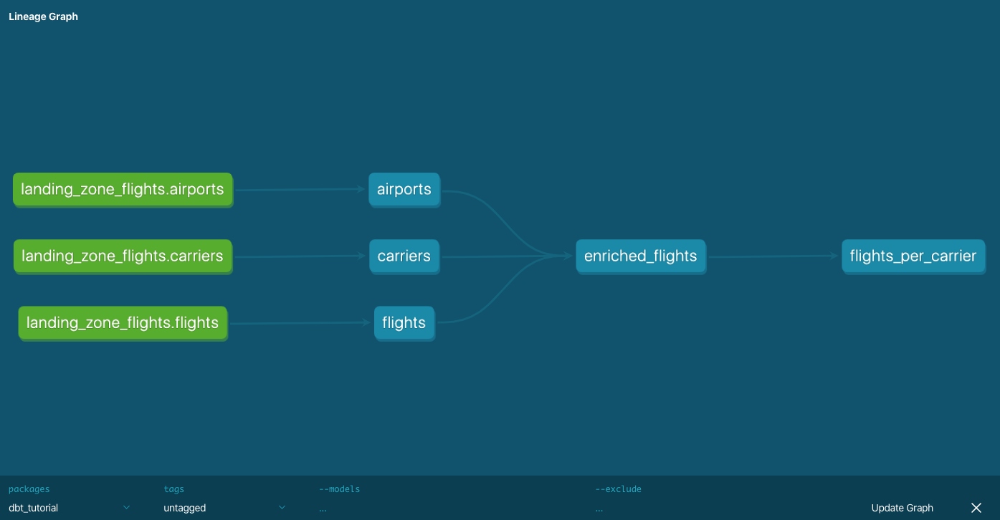

# DBT tutorial

Building data warehouses and doing analytics is still an unsolved problem at many companies.
Luckily, live is getting easier in the current age of [~~ETL~~ ELT](https://www.guru99.com/etl-vs-elt.html).
Cloud providers provide scalable databases like Snowflake and BigQuery; there is less work in loading data with tools like [Stitch](http://stitchdata.com/); and there are many BI tools.

dbt is an analytics engineering tool for and is one of the pieces of this puzzle.
It aims to "enables data analysts and engineers to transform data in their warehouses more effectively".
This tutorial gives an introduction to dbt with Google BigQuery and shows a basic project.


## Load data in BigQuery

First, set up the data in the landing zone. 
Clone [the repository](https://github.com/hgrif/dbt_tutorial) and navigate to `flights_data/`.
There are three CSV's with flight data from the [U.S. Department of Transportation](https://www.transtats.bts.gov/DL_SelectFields.asp?Table_ID=236).
One CSV contains flight statistics and the other two map airport IDs and carrier IDs to their names.
Unzip the data, create a new project in Google Cloud, create a new bucket in Cloud Storage, and upload the CSV's.

The next step is to load the CSV's as tables in [BigQuery](https://cloud.google.com/bigquery/docs/loading-data-cloud-storage-csv).
Create a new dataset `landing_zone_flights` in BigQuery and create tables for each of the files.
Schema detection will go fine for `airports.csv` and `flights.csv` ().
For `carriers.csv` you will have to manually set `Code` and `Description` as column names, and set it to skip 1 header row under Advanced Options.
Keep on clicking and create two more datasets to the project for our DEV and PRD environment: `flights_prd` and `flights_dev_hg`.
(Replace `hg` by your own initials and check the location for both datasets.)

The data and tables have been set up.
You should now have three datasets and three tables in `landing_zone_flights`:




## Set up development environment

With your data set up, it is time to set up the development environment.
Create a new Python virtual environment with `dbt` installed via `pip` or `conda`.
Open your dbt profile located at `~/.dbt/profiles.yml` and change it so that it points to your PRD and DEV environments.
Check the [documentation](https://docs.getdbt.com/docs/profile-bigquery) for profile configuration instructions for BigQuery (don't forget the authorization!).

My profile is `flights` and my default run target is `dev`:

```
flights:
  outputs:
    prd:
      type: bigquery
      method: oauth
      project: flights-project-707
      dataset: flights_prd
      threads: 10
      location: EU # Optional, one of US or EU
    dev:
      type: bigquery
      method: oauth
      project: flights-project-707
      dataset: flights_dev_hg
      threads: 10
      location: EU # Optional, one of US or EU
  target: dev
```

Your environment is now ready to go.
Run `dbt run --profile flights` to populate our data warehouse.
It should complete successfully:




## Load and test data sources

You have now manually done the first two stages of the ELT process.
The **extract** and **load** phase were done uploading the data in Cloud Storage and creating the landing zone tables in BigQuery.
The first step of the **transformation** phase is harmonizing column names and fixes any incorrect types.

Navigate to `models/base` and inspect the SQL files.
The code is fairly straightforward.
Each file contains a `SELECT` statement that loads a table and renames columns if needed. 
You will also see the first piece of dbt magic: there are [Jinja templates](https://docs.getdbt.com/docs/getting-started-with-jinja) in our SQL queries!

Statements like `{{ source('landing_zone_flights', 'flights') }}` refer to your [source tables](https://docs.getdbt.com/docs/using-sources): the BigQuery tables.
These tables are defined in `schema.yml` that [documents and tests your data models](https://docs.getdbt.com/docs/schemayml-files).
`landing_zone_flights` is a source with definitions and documentation for the three BigQuery tables.
Some columns are also tested for uniqueness, absence of nulls values, and relations within tables.
Tests help you make sure that your data model is not only defined, but also correct.

Navigate to `flights.sql`.
This file contains a nice trick to limit the processed data when developing.
The if-statement uses a [variable](https://docs.getdbt.com/docs/using-variables) to check the statement is run in development or in production. 
Flights data is limited to 2019-01-03 because you don't need all data during development.
This is another example of how dbt uses Jinja so to do things you normally cannot do in SQL.

The source tables are (re)created as views in BigQuery if you run `dbt run --profile flights`.
Similarly, run tests with `dbt test --profile flights`:



You have now loaded the data in the DEV environment and can validate incoming data.
Try populating the PRD environment by changing the `--target` in the `dbt run` command.
The next step is transforming the data into something interesting!


## Transform data

Our queries in `models/transform` are quite similar to our load queries.
The biggest different is that now `ref()` is used to referenced to data models: this is [the most important function](https://docs.getdbt.com/docs/ref) in dbt.
`enriched_flights.sql` enriches the flights table by combining the sources tables and `flights_per_carriers.sql`.
The schema definition is missing definitions and tests for `enriched_flights`, not agreeing with the [dbt coding conventions](https://github.com/fishtown-analytics/corp/blob/master/dbt_coding_conventions.md) -- my bad!

dbt also has a documentation lineage tool to inspect how these transformations.
Run the following commands to generate and serve the documentation:

```sh
$ dbt docs generate --profile flights
$ dbt docs serve --port 8001 --profile flights
```



A new browser tab should open with documentation on the project and the resulting database.
The project overview shows the sources and models that are defined in the SQL files.
This overview gives documentation and column definitions, but also the original SQL queries and the compiled versions.
The database overview gives the same results but shows it like a database explorer.
All the way in the bottom-right corner you can find the lineage tool, giving an overview of how models or tables related to each other. 




## Conclusion

This tutorial showed you the basics of dbt with BigQuery.
dbt supports many other databases and technologies like Presto, Microsoft SQL Server and Postgres.
Our team has [recently](https://godatadriven.com/blog/godatadriven-open-source-contribution-for-q4-2019/) extended the Spark (and even our CTO has [chimed in](https://github.com/fishtown-analytics/dbt-spark/pull/43)).
Read the [dbt blog](https://blog.getdbt.com/what--exactly--is-dbt-/) for more background or go to directly to the [documentation](https://docs.getdbt.com/docs/documentation)!

You can find the code and data for this tutorial [here](https://github.com/hgrif/dbt_tutorial).
